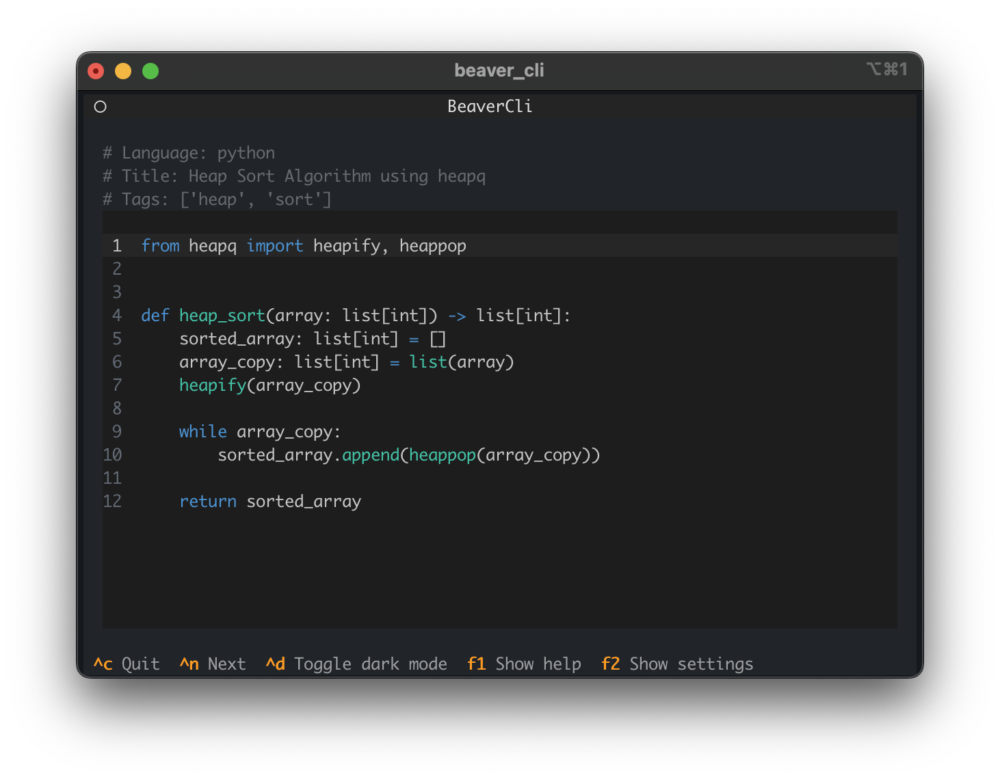

# Beaver
The Beaver Project is an interactive simulator for practicing hand typing by writing well-known algorithms and data structures. Designed as a fun and engaging tool, it’s ideal for programmers looking to improve typing skills, brush up on classic coding problems, or even procrastinate a bit during meetings.



Whether you're aiming to improve typing speed, practice coding, or simply enjoy a quick mental break, the Beaver Project is a productive way to engage with fundamental programming concepts in a relaxed setting.

## Installation and Usage
Verify that Python 3.12 or higher is installed on your system.

Install the beaver_cli application using pipx or a regular pip:

```bash
pipx install beaver_cli
```
Launch the CLI application from your preferred terminal:

```bash
python beaver_cli
```

## Organized as a monorepo, the Beaver Project includes:

* [beaver_cli](frontend/beaver_terminal/README.md): A command-line interface application that acts as the frontend for the Beaver Project. With a TUI (text-based user interface), it provides a GUI-like experience within the terminal, making it intuitive and user-friendly.
* [Dataset of Algorithms](dataset/python/): A comprehensive set of well-known algorithms and data structures available for practice.
* [beaver_etl](backend/apps/beaver_etl/README.md): An ETL job responsible for synchronizing the dataset with cloud storage, ensuring that data is always up-to-date and accessible.
* [beaver_api](backend/apps/beaver_api/README.md): The API service for the project, providing endpoints for managing and retrieving algorithm data.
* [beaver_linter](backend/apps/beaver_linter/README.md): A linter tool that parses the dataset to validate the format of beaver.json, where metadata for algorithms is stored, ensuring data consistency and schema compliance.


## How to Contribute
First, install [pre-commit](https://pre-commit.com/) and set up the hooks in your Git environment `pre-commit install`. This small step can save you a lot of time by catching issues early.

### Adding or Improving Algorithms in the Dataset
To contribute an algorithm or enhance an existing one, create a Pull Request with your changes. Be sure to include a beaver.json file, which contains the metadata needed to parse and store your algorithm in the database. Once your PR is merged, your algorithm will automatically sync with the cloud database.

**Key Requirements:**
1. Single File: Your algorithm must be contained within a single file.
2. Meaningful Metadata: The beaver.json file should reference the code file directly. Include clear, relevant metadata in beaver.json. Avoid fake links to documentation or inappropriate tags. If you'd prefer to stay anonymous, feel free to use generic information, like:

```json
{
    "name": "Anonym",
    "last_name": "Anonym",
    "email": "anonym@anonym.com"
}
```
(No emails will be sent, and we do not verify this information, so privacy-conscious contributors can use fictitious details.)

3. Testing: Ensure that your algorithm includes tests to validate its functionality.

### Contributing to the Beaver Project Source Code
If you're interested in contributing to the Beaver Project source code, you likely already know your way around! Here are a few key points to keep in mind:

* Typing: Please ensure all code is fully typed—no shortcuts on type annotations.
* PEP 8 Compliance: This should be straightforward with pre-commit and ruff to handle linting automatically.
* Scope of Changes: Keep your PRs focused. Avoid large, multi-purpose PRs; limit them to essential code changes for the task at hand. Try not to mix refactoring, bug fixes, or new features in a single PR. If you can break a large PR into smaller parts, please do so.

*Note: You may notice I sometimes break my own rules... perks of being the maintainer, I guess!*
