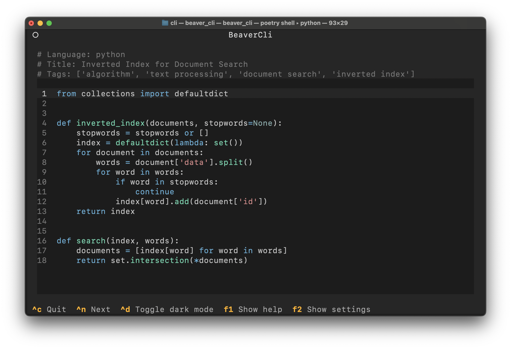

# Beaver

Beaver is a command-line application that combines typing practice with algorithm learning. Inspired by Monkeytype and LeetCode, it provides a fun and educational way to improve your coding skills and typing speed by having you type out classical algorithms in a Text User Interface (TUI) environment.


## Features

- **Typing Practice with Algorithms**: Improve your typing speed and accuracy by typing out actual algorithm code.
- **Algorithm Refresh**: Revisit and reinforce your understanding of classical algorithms and data structures.
- **TUI Frontend**: Enjoy an intuitive and distraction-free typing experience in your terminal.

## Installation

Beaver is available on [PyPI](https://pypi.org/project/beaver/). You can install it using `pip`:

```bash
pip install beaver_cli
```

## Usage
After installing, you can start using Beaver directly from your terminal.

### Starting a Session
To begin a typing session, simply run:
```bash
beaver_cli
```

### Screenshots



### License
This project is licensed under the GNU GENERAL PUBLIC LICENSE.
